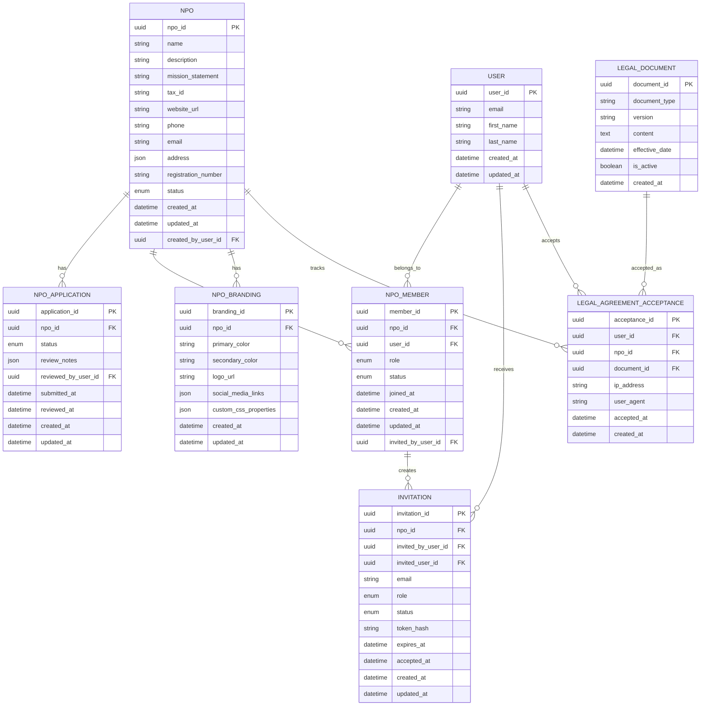

# Data Model: NPO Creation and Management

**Date**: 2025-10-19  
**Status**: Phase 1 - Data Model Design

## Entity Relationship Overview



## Entity Definitions

### NPO (Non-Profit Organization)
**Purpose**: Core entity representing a verified non-profit organization  
**Tenant Root**: Yes - serves as tenant identifier for multi-tenant isolation

| Field | Type | Constraints | Description |
|-------|------|-------------|-------------|
| npo_id | UUID | PK, NOT NULL | Primary key, serves as tenant_id |
| name | VARCHAR(255) | UNIQUE, NOT NULL | Organization legal name |
| description | TEXT | - | Brief organization description |
| mission_statement | TEXT | - | Organization mission and goals |
| tax_id | VARCHAR(50) | - | Tax identification number (EIN, etc.) |
| website_url | VARCHAR(500) | - | Organization website |
| phone | VARCHAR(20) | - | Primary contact phone |
| email | VARCHAR(255) | NOT NULL | Primary contact email |
| address | JSON | - | Full address object with street, city, state, zip, country |
| registration_number | VARCHAR(100) | - | State/country registration number |
| status | ENUM | NOT NULL | `DRAFT`, `PENDING_APPROVAL`, `APPROVED`, `SUSPENDED`, `REJECTED` |
| created_at | TIMESTAMP | NOT NULL | Record creation time |
| updated_at | TIMESTAMP | NOT NULL | Last modification time |
| created_by_user_id | UUID | FK to USER | User who initiated NPO creation |

**Validation Rules**:
- Name must be unique across platform
- Email format validation
- Tax ID format validation (country-specific)
- Status transitions follow state machine rules
- Address JSON schema validation

**State Transitions**:
- `DRAFT` → `PENDING_APPROVAL` (on submission)
- `PENDING_APPROVAL` → `APPROVED` (SuperAdmin approval)
- `PENDING_APPROVAL` → `REJECTED` (SuperAdmin rejection)
- `REJECTED` → `PENDING_APPROVAL` (resubmission after corrections)
- `APPROVED` → `SUSPENDED` (SuperAdmin enforcement action)
- `SUSPENDED` → `APPROVED` (SuperAdmin restoration)

### NPO_APPLICATION
**Purpose**: Tracks the approval workflow and review process for NPO applications

| Field | Type | Constraints | Description |
|-------|------|-------------|-------------|
| application_id | UUID | PK, NOT NULL | Primary key |
| npo_id | UUID | FK to NPO, NOT NULL | Associated NPO |
| status | ENUM | NOT NULL | `SUBMITTED`, `UNDER_REVIEW`, `APPROVED`, `REJECTED` |
| review_notes | JSON | - | SuperAdmin review comments and feedback |
| reviewed_by_user_id | UUID | FK to USER | SuperAdmin who reviewed |
| submitted_at | TIMESTAMP | - | Application submission time |
| reviewed_at | TIMESTAMP | - | Review completion time |
| created_at | TIMESTAMP | NOT NULL | Record creation time |
| updated_at | TIMESTAMP | NOT NULL | Last modification time |

**Validation Rules**:
- Only one active application per NPO
- Review notes required for rejected applications
- Reviewer must have SuperAdmin role

### NPO_MEMBER
**Purpose**: Manages staff and administrator relationships within NPOs

| Field | Type | Constraints | Description |
|-------|------|-------------|-------------|
| member_id | UUID | PK, NOT NULL | Primary key |
| npo_id | UUID | FK to NPO, NOT NULL | Associated NPO (tenant isolation) |
| user_id | UUID | FK to USER, NOT NULL | Associated user |
| role | ENUM | NOT NULL | `ADMIN`, `CO_ADMIN`, `STAFF` |
| status | ENUM | NOT NULL | `ACTIVE`, `INVITED`, `SUSPENDED`, `REMOVED` |
| joined_at | TIMESTAMP | - | When user accepted invitation |
| created_at | TIMESTAMP | NOT NULL | Record creation time |
| updated_at | TIMESTAMP | NOT NULL | Last modification time |
| invited_by_user_id | UUID | FK to USER | User who created the invitation |

**Validation Rules**:
- Unique constraint on (npo_id, user_id)
- At least one ADMIN must exist per NPO
- Role hierarchy: ADMIN > CO_ADMIN > STAFF
- Only ADMIN can invite CO_ADMIN roles

**Permission Matrix**:
| Action | ADMIN | CO_ADMIN | STAFF |
|--------|-------|----------|--------|
| Invite ADMIN | ❌ | ❌ | ❌ |
| Invite CO_ADMIN | ✅ | ❌ | ❌ |
| Invite STAFF | ✅ | ✅ | ❌ |
| Manage NPO Settings | ✅ | ✅ | ❌ |
| Create Events | ✅ | ✅ | ✅ |
| View Analytics | ✅ | ✅ | ✅ |

### NPO_BRANDING
**Purpose**: Stores visual identity and theming configuration for NPOs

| Field | Type | Constraints | Description |
|-------|------|-------------|-------------|
| branding_id | UUID | PK, NOT NULL | Primary key |
| npo_id | UUID | FK to NPO, UNIQUE, NOT NULL | Associated NPO (one branding per NPO) |
| primary_color | VARCHAR(7) | - | Hex color code for primary brand color |
| secondary_color | VARCHAR(7) | - | Hex color code for secondary brand color |
| logo_url | VARCHAR(500) | - | Azure Blob Storage URL for logo |
| social_media_links | JSON | - | Social media platform URLs and handles |
| custom_css_properties | JSON | - | Additional CSS custom properties |
| created_at | TIMESTAMP | NOT NULL | Record creation time |
| updated_at | TIMESTAMP | NOT NULL | Last modification time |

**Social Media Links JSON Schema**:
```json
{
  "facebook": "https://facebook.com/orgname",
  "twitter": "@orghandle",
  "instagram": "@orghandle", 
  "linkedin": "https://linkedin.com/company/orgname",
  "youtube": "https://youtube.com/c/orgname",
  "website": "https://organization.org",
  "custom": [
    {"name": "TikTok", "url": "https://tiktok.com/@orghandle"}
  ]
}
```

**Validation Rules**:
- Color codes must be valid hex format (#RRGGBB)
- Logo URL must be from approved Azure Blob container
- Social media URLs validated against platform-specific patterns
- Accessibility contrast ratio checking for color combinations

### INVITATION
**Purpose**: Manages invitation workflow for NPO staff and administrators

| Field | Type | Constraints | Description |
|-------|------|-------------|-------------|
| invitation_id | UUID | PK, NOT NULL | Primary key |
| npo_id | UUID | FK to NPO, NOT NULL | Associated NPO (tenant isolation) |
| invited_by_user_id | UUID | FK to USER, NOT NULL | User who created invitation |
| invited_user_id | UUID | FK to USER | Set when existing user is invited |
| email | VARCHAR(255) | NOT NULL | Invitation target email |
| role | ENUM | NOT NULL | `ADMIN`, `CO_ADMIN`, `STAFF` |
| status | ENUM | NOT NULL | `PENDING`, `ACCEPTED`, `EXPIRED`, `REVOKED` |
| token_hash | VARCHAR(255) | UNIQUE, NOT NULL | Hashed invitation token |
| expires_at | TIMESTAMP | NOT NULL | Invitation expiry (7 days from creation) |
| accepted_at | TIMESTAMP | - | When invitation was accepted |
| created_at | TIMESTAMP | NOT NULL | Record creation time |
| updated_at | TIMESTAMP | NOT NULL | Last modification time |

**Validation Rules**:
- Token hash must be cryptographically secure
- Expiry must be within 7 days of creation
- Email format validation
- Only one pending invitation per email per NPO

**Invitation Flow**:
1. NPO Admin creates invitation with email and role
2. System generates secure token and sends email
3. Recipient clicks link, creates account (if needed)
4. Token validated, NPO_MEMBER record created
5. Invitation marked as accepted, token invalidated

### LEGAL_DOCUMENT
**Purpose**: Manages versioned legal agreements (EULA, Terms, Privacy Policy)

| Field | Type | Constraints | Description |
|-------|------|-------------|-------------|
| document_id | UUID | PK, NOT NULL | Primary key |
| document_type | ENUM | NOT NULL | `EULA`, `TERMS_OF_SERVICE`, `PRIVACY_POLICY`, `DPA` |
| version | VARCHAR(20) | NOT NULL | Semantic version (1.0.0, 1.1.0) |
| content | TEXT | NOT NULL | Full document content (Markdown/HTML) |
| effective_date | TIMESTAMP | NOT NULL | When document becomes active |
| is_active | BOOLEAN | NOT NULL | Current version flag |
| created_at | TIMESTAMP | NOT NULL | Record creation time |

**Validation Rules**:
- Only one active document per type at a time
- Version must follow semantic versioning
- Effective date cannot be in the past
- Content must not be empty

### LEGAL_AGREEMENT_ACCEPTANCE
**Purpose**: Tracks user acceptance of legal documents for compliance

| Field | Type | Constraints | Description |
|-------|------|-------------|-------------|
| acceptance_id | UUID | PK, NOT NULL | Primary key |
| user_id | UUID | FK to USER, NOT NULL | User who accepted |
| npo_id | UUID | FK to NPO | NPO context (null for platform-wide) |
| document_id | UUID | FK to LEGAL_DOCUMENT, NOT NULL | Accepted document version |
| ip_address | INET | NOT NULL | Client IP address |
| user_agent | VARCHAR(500) | NOT NULL | Client browser/app info |
| accepted_at | TIMESTAMP | NOT NULL | Acceptance timestamp |
| created_at | TIMESTAMP | NOT NULL | Record creation time |

**Validation Rules**:
- Unique constraint on (user_id, npo_id, document_id)
- IP address must be valid IPv4/IPv6
- User agent string sanitized to prevent XSS

## Database Indexes

### Performance Indexes
```sql
-- Primary queries for NPO operations
CREATE INDEX idx_npo_status ON npo(status);
CREATE INDEX idx_npo_created_by ON npo(created_by_user_id);

-- Multi-tenant isolation
CREATE INDEX idx_npo_member_npo_id ON npo_member(npo_id);
CREATE INDEX idx_npo_member_user_role ON npo_member(user_id, role);

-- Application workflow queries
CREATE INDEX idx_application_status ON npo_application(status);
CREATE INDEX idx_application_submitted ON npo_application(submitted_at);

-- Invitation management
CREATE INDEX idx_invitation_email_status ON invitation(email, status);
CREATE INDEX idx_invitation_expires ON invitation(expires_at);
CREATE INDEX idx_invitation_token ON invitation(token_hash);

-- Legal compliance queries
CREATE INDEX idx_legal_acceptance_user_doc ON legal_agreement_acceptance(user_id, document_id);
CREATE INDEX idx_legal_document_type_active ON legal_document(document_type, is_active);
```

### Composite Indexes for Complex Queries
```sql
-- NPO member lookup by organization and status
CREATE INDEX idx_npo_member_org_status ON npo_member(npo_id, status);

-- Active invitations by NPO
CREATE INDEX idx_invitation_npo_status ON invitation(npo_id, status);

-- User's NPO memberships
CREATE INDEX idx_npo_member_user_status ON npo_member(user_id, status);
```

## Row-Level Security (RLS) Policies

### Multi-Tenant Isolation
```sql
-- NPO data isolation
CREATE POLICY npo_tenant_isolation ON npo
  USING (
    npo_id IN (
      SELECT npo_id FROM npo_member 
      WHERE user_id = current_user_id() 
      AND status = 'ACTIVE'
    )
    OR current_user_role() = 'SUPERADMIN'
  );

-- NPO member isolation  
CREATE POLICY npo_member_isolation ON npo_member
  USING (
    npo_id IN (
      SELECT npo_id FROM npo_member 
      WHERE user_id = current_user_id() 
      AND status = 'ACTIVE'
    )
    OR current_user_role() = 'SUPERADMIN'
  );
```

## Data Validation Rules

### Application Rules
1. **NPO Name Uniqueness**: Case-insensitive unique constraint
2. **Email Validation**: RFC 5322 compliant email format
3. **Tax ID Format**: Country-specific validation patterns
4. **Status Transitions**: Enforced via application logic and database triggers
5. **Role Hierarchy**: Database constraints prevent invalid role assignments

### Security Rules
1. **Token Security**: Invitation tokens use cryptographic random generation
2. **Password Requirements**: Enforced at user level (existing system)
3. **Session Management**: JWT tokens with sliding expiration
4. **Audit Trail**: All sensitive operations logged with user context

### Business Rules
1. **NPO Approval Gates**: Cannot create events or send invitations before approval
2. **Legal Acceptance**: Required before NPO activation
3. **Admin Requirements**: At least one active admin per approved NPO
4. **Invitation Limits**: Max 50 pending invitations per NPO

## Migration Strategy

### Phase 1: Core Tables
1. Create NPO and NPO_APPLICATION tables
2. Basic user role extensions
3. Legal document infrastructure

### Phase 2: Advanced Features
1. Branding and file storage integration
2. Invitation system with email notifications
3. Audit logging and compliance features

### Phase 3: Optimization
1. Performance indexes based on usage patterns
2. Archival strategy for old applications
3. Data retention policy implementation

## Backup and Recovery

### Data Classification
- **Critical**: NPO records, legal acceptances (7-year retention)
- **Important**: Applications, member relationships (3-year retention)  
- **Standard**: Branding, invitations (1-year retention)

### Recovery Procedures
- Point-in-time recovery for critical data corruption
- Selective restore for individual NPO data
- Legal compliance export for audit requests